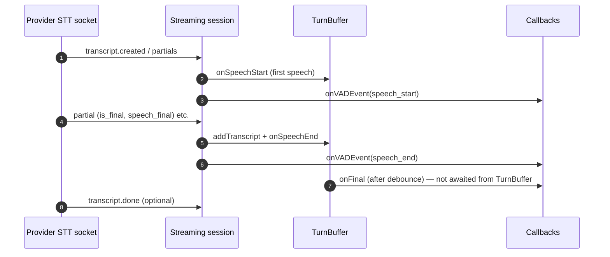
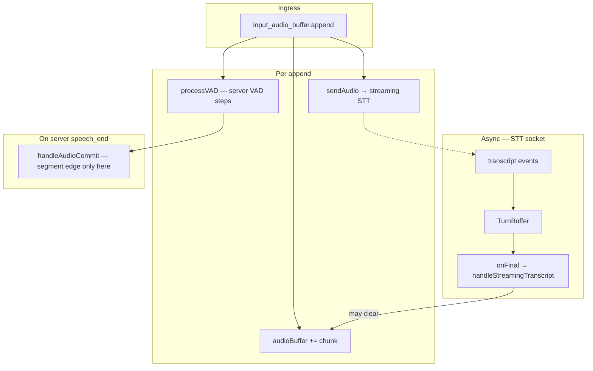
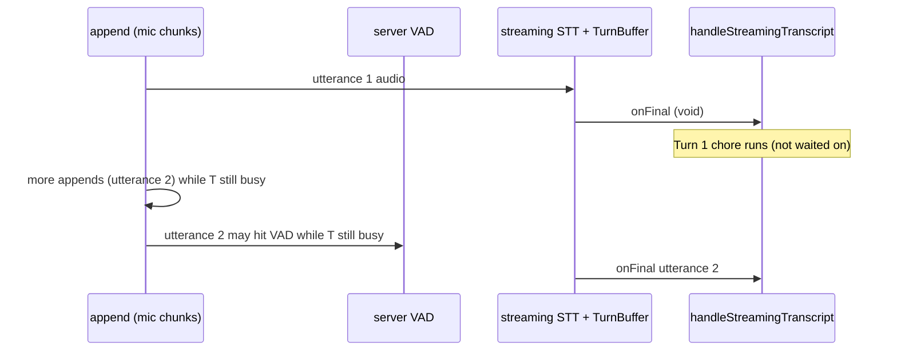

# Streaming STT + server VAD — audio trace report

**Scope:** How PCM flows from **`input_audio_buffer.append`** through **server VAD** (`processVAD`) and **streaming STT** (e.g. Grok WebSocket): **`sendAudio`**, provider **`onVADEvent`**, **`TurnBuffer`**, and optional debug WAVs.  

**Out of scope:** Batch / commit ASR backends (e.g. code paths that call **`transcribeAudio`** inside **`handleAudioCommit`**). This doc is only the **streaming STT + server VAD** story you care about.

**Assumptions:**

- **`turn_detection`** is non-null (server VAD mode in session config).
- A **VAD provider** is enabled (`VAD_PROVIDER` ≠ `none`, `vad.enabled` true).
- STT is **streaming** (`shouldUseStreamingSTT` true) — e.g. registry name `grok`.

**Diagrams:** §3.1, §5.1, §7.1, §10, §11, §14. Mermaid-capable Markdown preview required.

**Sources:** `src/session/handlers/audio.ts`, `packages/provider-grok-stt`, `src/session/utils/stt-audio-debug.ts`, `src/services/turn-detection/TurnBuffer.ts`, `src/session/vad/processor.ts`.

---

## 1. Filename pattern (STT debug WAV)

When `STT_AUDIO_DEBUG=1` and eligibility passes (see §2, `stt-audio-debug.ts`):

| File | Contents |
|------|----------|
| `{sessionId}__{itemId}__grok.wav` | Per-utterance capture (§4). |
| `{sessionId}__session_stt__grok.wav` | **Full session:** every PCM chunk **after** a successful `sendAudio` for the WebSocket; written on connection **close**. |

- **`itemId`** — `currentInputTranscriptionItemId` at write time (from streaming **`speech_start`** in `handleStreamingSttVadEvent`).
- One per-utterance file ≈ one **`TurnBuffer`**-driven **`onFinal`** (§4), not necessarily one server-VAD segment.
- Compare **session** vs **per-utterance** WAVs to see lead-in/tail gaps vs what was actually placed on the Grok socket.

---

## 2. STT debug WAV vs server VAD

`shouldRecordStreamingSttDebug` **disables** disk capture when `runtimeConfig.providers.vad.provider === 'silero'` (the default local server VAD name in many deployments).

So with **typical server VAD**, **`.audio-debug` WAVs are off** even if `STT_AUDIO_DEBUG=1`. The **streaming + server-VAD behavior** below still applies to live transcripts; only **on-disk** debug is gated.

---

## 3. One `append` cycle (streaming STT + server VAD)

Per chunk, **`handleAudioAppend`** runs **in order**:

1. Decode base64 → PCM16.
2. Start **`sttStream`** if needed → **`startStream(callbacks)`**.
3. **`waitForConnection` → `sendAudio(chunk)`** → streaming provider (e.g. Grok WS).
4. **`appendStreamingSttDebugPcm`** if the debug buffer is active (§2, §4).
5. **`audioBuffer += chunk`**.
6. **`totalAudioMs`** += chunk duration.
7. If **`vadEnabled`** && **`turn_detection`** && not **`*-integrated`** VAD mode: **`processVAD`** (resample 24 kHz → 16 kHz, 512-sample steps) → on **server `speech_end`**, **`await handleAudioCommit(...)`** (segment boundary in code; batch ASR inside that handler is **out of scope** here).

Provider STT messages (**`transcript.partial`**, etc.) are **asynchronous** relative to steps 1–7.

### 3.1 Diagram — synchronous half of `append`

```mermaid
sequenceDiagram
  autonumber
  participant C as Client
  participant H as handleAudioAppend
  participant S as sttStream (streaming STT)
  participant AB as data.audioBuffer
  participant D as sttStreamingDebugPcm
  participant V as processVAD (server VAD)

  C->>H: input_audio_buffer.append
  H->>H: decode PCM16
  alt need stream && shouldUseStreamingSTT
    H->>S: startStream(callbacks)
  end
  H->>S: waitForConnection + sendAudio(chunk)
  H->>D: appendStreamingSttDebugPcm (if recording)
  H->>AB: concatenate(chunk)
  H->>H: totalAudioMs +=
  opt vadEnabled && turn_detection && not integrated VAD
    H->>V: detectSpeech (512 @ 16 kHz)
    V-->>V: speech_start / speech_end
    Note over V: on speech_end → await handleAudioCommit (segment edge; batch path omitted)
  end
```

---

## 4. What debug WAV contains (when enabled)

Same semantics as before: recording **starts** on streaming provider **`onVADEvent(speech_start)`**, **stops** at **`onFinal`** after **`finalizeStreamingSttDebugWav`**.

- **Lead-in missing** — PCM already **`sendAudio`’d** before **`speech_start`**.
- **Tail missing** — **`onFinal`** clears debug buffer; later chunks go to the next window or nowhere on disk.
- **Alignment** — provider **`speech_start`** vs mic timeline can lag a chunk or more.

---

## 5. Two boundary layers (both matter for UX)

With **server VAD** + **streaming STT**:

| Layer | Role |
|--------|------|
| **Server VAD** (`processVAD`) | Energy/ML segmentation on **resampled** audio; **`speech_end`** → **`handleAudioCommit`** (protocol / buffer edge). |
| **Streaming provider** | **`onVADEvent`**, partials, **`TurnBuffer`**, **`onFinal`** → **`handleStreamingTranscript`** (the streaming ASR result this doc focuses on). |

They use **different** signals and **different** timing; they are **not** guaranteed to match.

### 5.1 Diagram — async streaming STT (e.g. Grok)



---

## 6. `audioBuffer` (streaming-focused)

- Grows on every **`append`**.
- Cleared when **`handleStreamingTranscript`** finishes (streaming final) and on other handlers (e.g. commit path — **not detailed here**).
- Server VAD **`speech_end`** triggers **`handleAudioCommit`**, which reads **`audioBuffer`** at that instant for the **commit** path; **streaming** text still comes from **`onFinal`**.

### 6.1 State — `audioBuffer` vs debug PCM

```mermaid
stateDiagram-v2
  [*] --> AB_growing: append
  AB_growing --> AB_empty: handleStreamingTranscript clears (streaming path)
  AB_growing --> AB_empty: clear / commit handlers

  state DBG as sttStreamingDebugPcm {
    [*] --> off
    off --> rec: provider speech_start + eligible
    rec --> rec: append after sendAudio
    rec --> off: finalize on onFinal
  }
```

---

## 7. Long vs tiny debug clips

- **Long** — many appends between provider **`speech_start`** and **`TurnBuffer` finalize**.
- **Tiny** — finalize very soon after **`speech_start`**, or **`TurnBuffer`** presets / LLM turn-detection timing.

---

## 8. Endpointing (Grok example)

Query may set `endpointing=0`; phrase ends still come from provider events + **`TurnBuffer`** debounce — can disagree with debug window (§4).

---

## 9. Summary — boundaries (streaming path only)

| Artifact | Driver |
|----------|--------|
| **User text (this doc)** | Streaming STT → **`TurnBuffer`** → **`onFinal`** → **`handleStreamingTranscript`**. |
| **Debug WAV (if enabled)** | Provider **`speech_start`** → **`onFinal`** window (§2, §4). |
| **Server segment edge** | **`processVAD`** **`speech_end`** → **`handleAudioCommit`** (batch ASR omitted). |

---

## 10. Design tensions (streaming + server VAD)

1. **Unawaited `onFinal`** — `void this.callbacks.onFinal(...)` in streaming session → **`handleStreamingTranscript`** overlaps later **appends** / **`audioBuffer`** updates.
2. **Mismatched segmenters** — server VAD **`speech_end`** vs provider **`speech_final` / `TurnBuffer`** → different instants for “end of talk”.
3. **Dual `speech_*` signals** — `processVAD` may **`sendSpeechStarted`/`Stopped`**; streaming callbacks also emit **`onVADEvent`** — clients/logs can see **two** notions of speech boundaries.

---

## 11. Swimlane — streaming STT + server VAD only



---

## 12. File reference

| File | Role |
|------|------|
| `src/session/handlers/audio.ts` | `handleAudioAppend`, streaming callbacks, `handleStreamingTranscript` |
| `packages/provider-grok-stt/src/GrokSTT.ts` | Example streaming STT WebSocket, `TurnBuffer`, `onVADEvent` |
| `src/services/turn-detection/TurnBuffer.ts` | Debounce / finalize → `onFinal` |
| `src/session/utils/stt-audio-debug.ts` | Debug WAV eligibility + I/O (per-utterance + session `__session_stt__` on close) |
| `src/session/vad/processor.ts` | `processVAD`, `speech_end` → `handleAudioCommit` |

---

## 13. xAI (Grok) streaming: why audio might be “mischunked” or missing

This section is about **bytes on the wire vs what the service transcribes**, and **engine-side gaps** before the socket. It complements §4–§5 (debug windows vs provider boundaries) and §10 (async / dual segmenters).

### 13.1 Engine never sends the chunk

- **`sendAudio` throws** if the Grok WebSocket is not `OPEN` or the session is not `active` (`Grok STT session not active`). The handler logs and **does not retry** that chunk.
- **STT stream start race:** While `sttStreamInitializing` is true, concurrent **`handleAudioAppend`** calls may run before `sttStream` is assigned. Those appends hit the “No STT stream” path — audio is **not** sent to xAI (it may still be appended to `audioBuffer` for other paths).
- **Hibernation:** After **`enterHibernation`**, the streaming STT session is ended until **`exitHibernation`**; mic audio in that window is **not** forwarded to xAI.
- **Socket `error` / `close`:** The Grok client sets `active = false`; further **`sendAudio`** calls fail until a new stream is established.

### 13.2 Sent locally but not “heard” the same way remotely

- **`ws.send(chunk)`** only queues data to the runtime’s WebSocket implementation. **Backpressure**, network loss, or xAI-side limits are **not** visible as failures here; transcripts can still lag, truncate, or segment differently than your server VAD expects.
- **Service-side segmentation** is independent of your **`endpointing=0`** query flag and your **server VAD** (`processVAD`). Partial / final / `speech_final` timing can **disagree** with when you think an utterance started or ended — that is **mischunking at the ASR layer**, not necessarily dropped PCM.

### 13.3 Transcript vs your WAVs

- **Per-utterance debug WAV** (§4) starts at provider **`speech_start`** and ends at **`onFinal`** — it can **omit lead-in** (already sent before `speech_start`) and **tail** (after finalize).
- **Session STT WAV** (§1) matches **successful `sendAudio`** only; use it to verify the engine did not drop chunks before the socket. If session audio sounds complete but xAI’s text is wrong, suspect **remote ASR / segmentation**; if session audio has gaps, suspect **§13.1**.

### 13.4 Interaction with TurnBuffer and unawaited `onFinal`

- **`onFinal`** is not awaited from the Grok session’s **`TurnBuffer`** callback. Overlapping **`handleStreamingTranscript`** with later **appends** and provider events can make **later turns** look “weird” even when individual chunks were delivered (§10, §14 below).

---

## 14. “First turn OK, later weird” (streaming path)

### 14.1 Picture two trains on one track

Imagine the **mic** is a train that **never stops**: every `input_audio_buffer.append` is another **car** arriving at the station.

Separately, when Grok decides “that sentence is done,” the code **starts a long chore**: **`handleStreamingTranscript`** (save text, maybe clean it, update history, maybe start the assistant reply). That chore can take a while.

**First turn often feels fine** because there is only one sentence and nothing else is “in the way.” **Later turns feel weird** because the **mic train keeps moving** while the **chore from the last sentence is still running**. Those two things are **interleaved** — that is what “**concurrently**” means here: *at the same time*, not one-after-the-other in a neat line.

### 14.2 “Fire-and-forget” in plain English

**Fire-and-forget** means: *we light the fuse and walk away.*

When **`TurnBuffer`** finishes and calls **`onFinal`**, the Grok code does **not** wait (“await”) for **`handleStreamingTranscript`** to fully finish. It says, in effect: “**Start** this work,” and immediately goes back to listening for **more Grok messages** and **more mic chunks**. So **`onFinal` is “forgetful”** in the sense that it **does not block** the rest of the pipeline until the transcript is fully processed.

That is usually efficient, but it means **turn 2’s audio and events** can arrive **while turn 1’s transcript is still being processed**. If anything in that processing touches **shared session stuff** (history, buffers, flags), you can get **ordering surprises** that show up more on **later** turns than on the first.

### 14.3 What “overlapping with later appends” means

An **append** is simply: *new audio from the client just landed.*

So **“overlapping with later appends”** means:

- Turn 1 is **done enough** for Grok to fire **`onFinal`**.
- The server **starts** handling that final text (the slow chore).
- **Before that chore finishes**, the user keeps talking — so **more `append` events** arrive with **turn 2’s** sound.
- Those appends still run through **`sendAudio`**, **`audioBuffer`**, **server VAD**, etc., **in parallel** with the unfinished work from turn 1.

It is **not** that one audio chunk is literally “merged” with another in the wire format; it is that **two different stages of the session** (finishing turn 1 vs capturing turn 2) are **active at the same time**, so bugs or racey state show up more when turns come **back-to-back**.

### 14.4 Two other “later weird” ingredients (short)

1. **Two stopwatches** — Server VAD may think “they stopped talking” at a **different time** than Grok’s **`speech_final`** / **`TurnBuffer`** timing. Back-to-back phrases make that mismatch more obvious.
2. **Grok’s little notebook** — The streaming client keeps flags like **`inSpeech`** and “did we already finalize?” If **`onFinal`** work is still in flight while new provider events arrive, **internal state** and **TurnBuffer resets** can get **out of sync** with what you expect from the audio alone.

### 14.5 Same idea as a tiny timeline (diagram)



---

*Streaming STT + server VAD only. Batch / Whisper / `transcribeAudio` intentionally omitted.*
