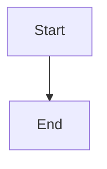

# sndbrd Wiki

VitePress-based documentation wiki for the sndbrd voice engine.

## Features

- ✅ **Mermaid Diagrams** - Flowcharts, sequence diagrams, architecture diagrams, and more
- ✅ **Vue Components** - Interactive components directly in Markdown
- ✅ **React Support** - React components via `@vitejs/plugin-react`
- ✅ **Enhanced Styling** - Custom CSS with improved typography and components
- ✅ **Dark Mode** - Automatic theme switching
- ✅ **Search** - Local search functionality
- ✅ **Responsive** - Mobile-friendly design

## Development

### Setup

```bash
cd wiki
bun install
```

### Run Development Server

```bash
bun run dev
```

The wiki will be available at `http://localhost:5173`.

### Build

```bash
bun run build
```

Output will be in `.vitepress/dist/`.

### Preview Production Build

```bash
bun run preview
```

## Configuration

### Mermaid Diagrams

Mermaid diagrams are supported via `vitepress-plugin-mermaid`. Use fenced code blocks with `mermaid` language:

````markdown

````

See `/examples/mermaid-example` for more examples.

### Vue Components

Vue components can be used directly in Markdown files:

```vue
<template>
  <div class="custom-component">
    <h3>{{ title }}</h3>
  </div>
</template>

<script setup>
import { ref } from 'vue'
const title = ref('Hello')
</script>
```

See `/examples/vue-components` for more information.

### React Components

React components are supported via `@vitejs/plugin-react`. They can be imported and used in Vue components or via the React plugin.

### MDX Support

**Note:** VitePress does not natively support MDX (Markdown for JSX). Instead, use:

- **Vue components** in Markdown (native, recommended)
- **React components** via plugin (requires wrapper)

This provides similar functionality to MDX while maintaining VitePress compatibility.

## Customization

### Theme

The theme is customized in `.vitepress/theme/`:

- `index.ts` - Theme entry point
- `custom.css` - Custom styles

### Configuration

Main configuration is in `.vitepress/config.ts`:

- Navigation
- Sidebar structure
- Mermaid settings
- Markdown options

## Structure

```
wiki/
├── .vitepress/
│   ├── config.ts          # VitePress configuration
│   └── theme/
│       ├── index.ts       # Theme entry point
│       └── custom.css      # Custom styles
├── docs/
│   ├── index.md           # Homepage
│   ├── architecture/      # Architecture docs
│   ├── api/               # API reference
│   ├── providers/         # Provider docs
│   ├── deployment/        # Deployment guides
│   ├── guides/            # How-to guides
│   └── examples/          # Example pages
└── package.json
```

## Enhancements from Platform Docs

This wiki includes enhancements from the platform-level docs:

- ✅ Enhanced typography and spacing
- ✅ Improved code block styling
- ✅ Better table formatting
- ✅ Custom badge components
- ✅ Grid card layouts
- ✅ Responsive design improvements
- ✅ Mermaid diagram support
- ✅ React plugin support

## Dependencies

- `vitepress` - Documentation framework
- `vue` - UI framework (VitePress default)
- `react` + `react-dom` - React support
- `@vitejs/plugin-react` - React plugin for Vite
- `vitepress-plugin-mermaid` - Mermaid diagram support
- `mermaid` - Diagram rendering engine

## License

Server Side Public License v1 (SSPL-1.0).
