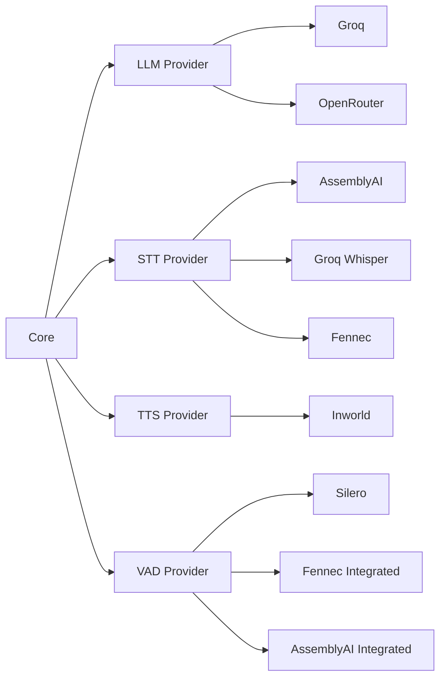
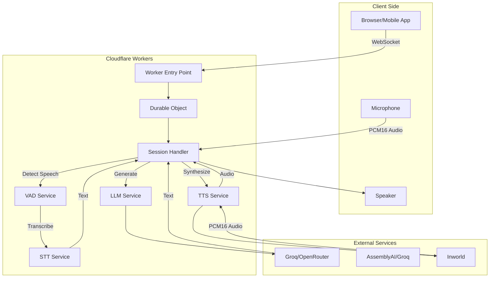
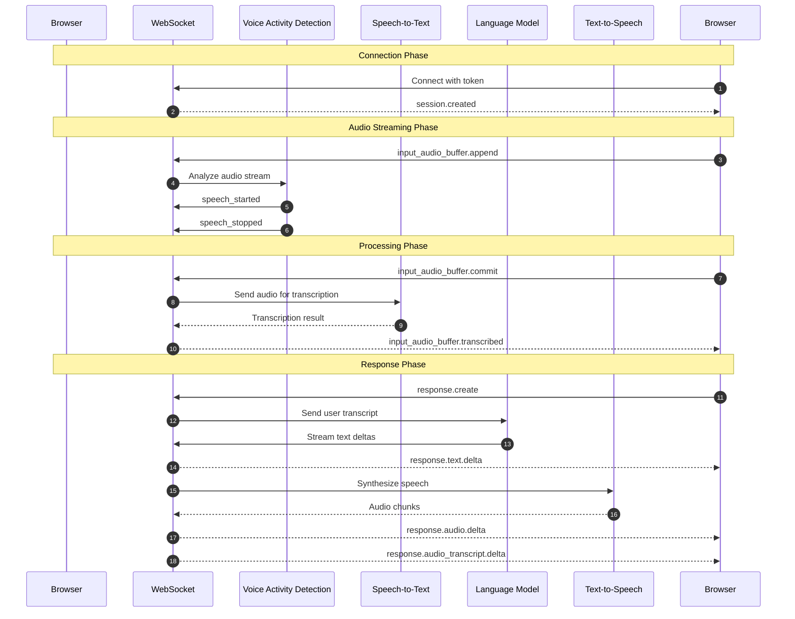
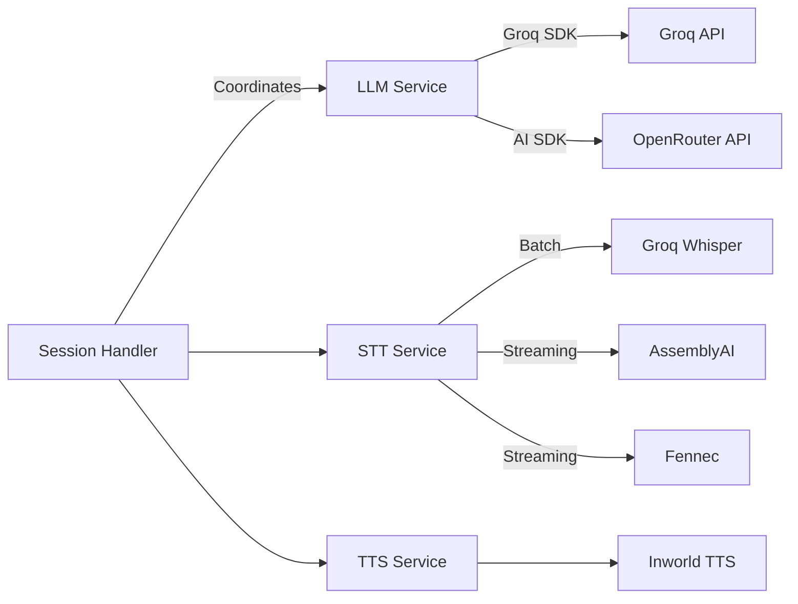
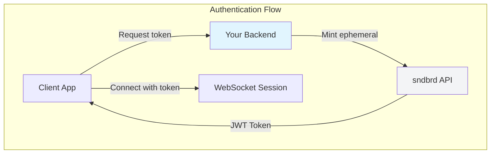

# Architecture Overview

The vowel engine is built with a modular, event-driven architecture for real-time voice interactions.

## Tech Stack

| Component | Technology | Purpose |
|-----------|------------|---------|
| **Runtime** | Bun / Node.js | Self-hosted runtime |
| **WebSocket** | Native WebSocket API | Bidirectional communication |
| **LLM** | Groq / OpenRouter | Fast inference, multiple models |
| **STT** | Groq Whisper | Audio transcription |
| **TTS** | Modular provider system | Speech synthesis |
| **Auth** | jose (JWT) | Ephemeral token generation |

## Core Principles

### Event-Driven Architecture

All communication happens via WebSocket events following the OpenAI Realtime API protocol. This provides:

- **Bidirectional streaming** - Audio and text flow simultaneously
- **Real-time responses** - Low latency interaction
- **Protocol compatibility** - Works with OpenAI clients

### Modular Provider System

Providers can be swapped without changing core logic:

### Edge-Native Design

Built specifically for Cloudflare Workers environment:

- **Zero cold starts** - Always warm at edge locations
- **Global distribution** - Automatic CDN routing
- **Cost efficient** - Only pay for what you use
- **Type-safe** - Full TypeScript with strict mode

## System Architecture

### High-Level View

### Data Flow

## Component Details

### Worker Entry Point

**Location:** `src/workers/worker.ts`

Handles HTTP requests and routes WebSocket upgrades:

- **Token generation** - Creates ephemeral JWT tokens
- **WebSocket routing** - Routes to Durable Objects
- **CORS handling** - Manages cross-origin requests
- **Health checks** - `/health` endpoint

### Durable Object (RealtimeSession)

**Location:** `src/workers/durable-objects/RealtimeSession.ts`

Stateful WebSocket session manager:

- **Session lifecycle** - Manages connection, state, and cleanup
- **Hibernation API** - Cost-efficient long-lived connections
- **State persistence** - Survives Worker restarts
- **Message routing** - Delegates to session handler

### Session Handler

**Location:** `src/session/handler.ts`

Main message router handling all OpenAI Realtime API events:

| Event | Direction | Purpose |
|-------|-----------|---------|
| `session.update` | Client → Server | Update session configuration |
| `input_audio_buffer.append` | Client → Server | Receive audio chunks |
| `input_audio_buffer.commit` | Client → Server | Process accumulated audio |
| `conversation.item.create` | Client → Server | Add messages to conversation |
| `response.create` | Client → Server | Generate AI response |
| `response.cancel` | Client → Server | Cancel in-progress response |
| `session.created` | Server → Client | Session established |
| `input_audio_buffer.transcribed` | Server → Client | Transcription available |
| `response.text.delta` | Server → Client | Text delta |
| `response.audio.delta` | Server → Client | Audio delta |

### Services Layer

**Location:** `src/services/`

Modular providers for each component:

## Audio Pipeline

The complete audio processing pipeline from microphone to speaker:

```mermaid
graph LR
    subgraph "Input (User)"
        M1[Microphone]
        M2[PCM16 24kHz Mono]
    end
    
    subgraph "Processing (Server)"
        P1[VAD Detection]
        P2[Speech Buffer]
        P3[Transcription]
        P4[LLM Generation]
        P5[TTS Synthesis]
    end
    
    subgraph "Output (AI)"
        O1[Speaker]
        O2[PCM16 24kHz Mono]
    end
    
    M1 -->|Capture| M2
    M2 -->|WebSocket Stream| P2
    P2 -->|On Silence| P1
    P1 -->|Trigger| P3
    P3 -->|Text| P4
    P4 -->|Text| P5
    P5 -->|Audio| O2
    O2 -->|Play| O1
```

## Scaling & Performance

### Edge Deployment

- **Global locations** - 300+ edge locations worldwide
- **Auto-scaling** - Handles traffic spikes automatically
- **No cold starts** - Workers always warm at edge

### Performance Metrics

| Metric | Target |
|--------|--------|
| **TTFS (Time to First Speech)** | < 500ms |
| **Latency (Round-trip)** | < 1s |
| **Audio quality** | 24kHz PCM16 |
| **Uptime** | 99.9% |

## Security Architecture

- **Ephemeral tokens** - 5-minute expiration, auto-refresh
- **JWT signing** - HMAC-SHA256, 32+ character secret
- **API key scoping** - Least privilege for backend services
- **No secrets in frontend** - Tokens generated server-side only

## Related

- [Request Flow](/architecture/request-flow) - Detailed request/response flow
- [Components](/architecture/components) - Component implementation details
- [Connection Paradigms](/architecture/connection-paradigms) - Advanced integration patterns
