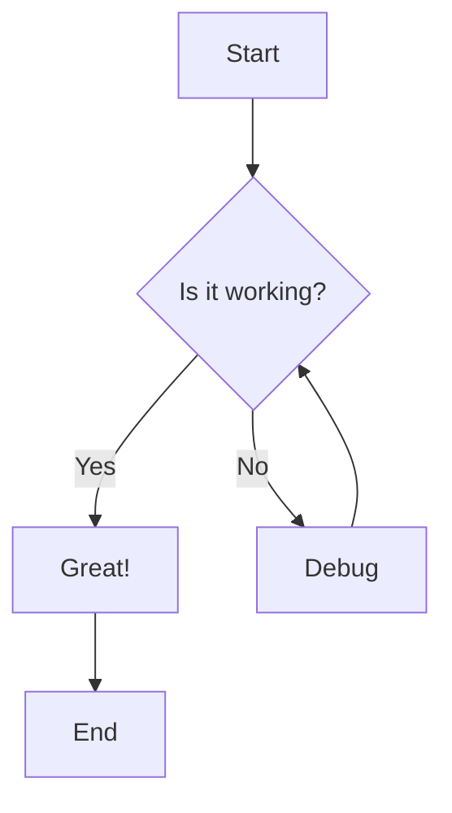
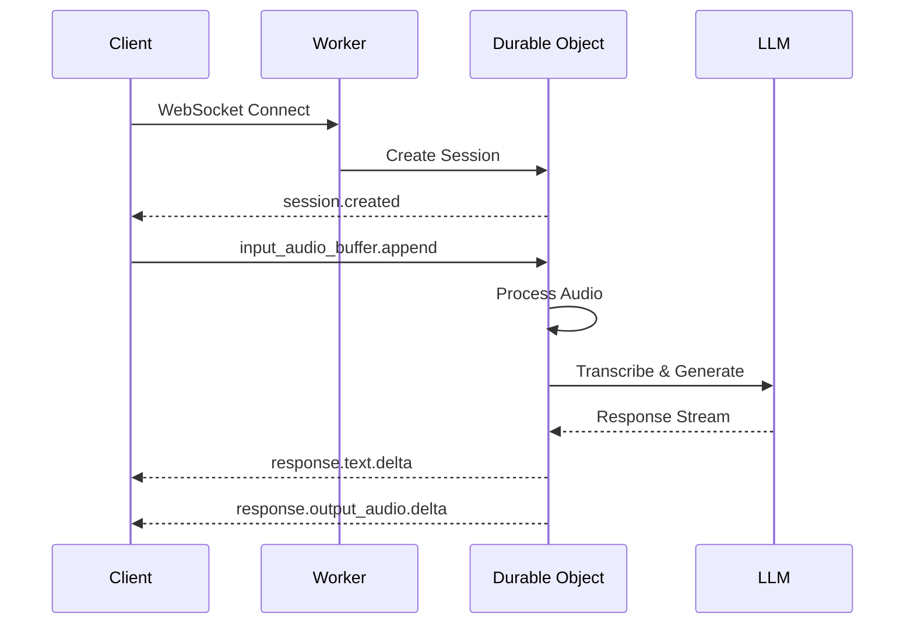
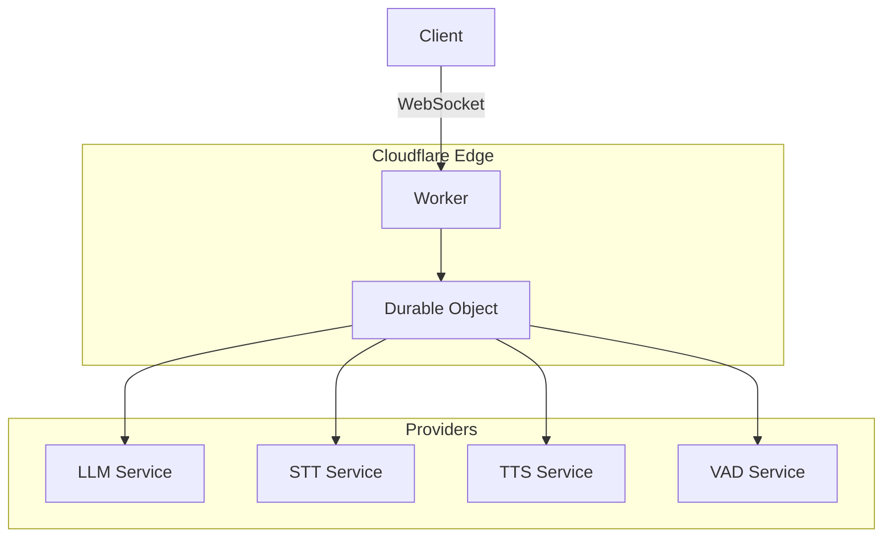
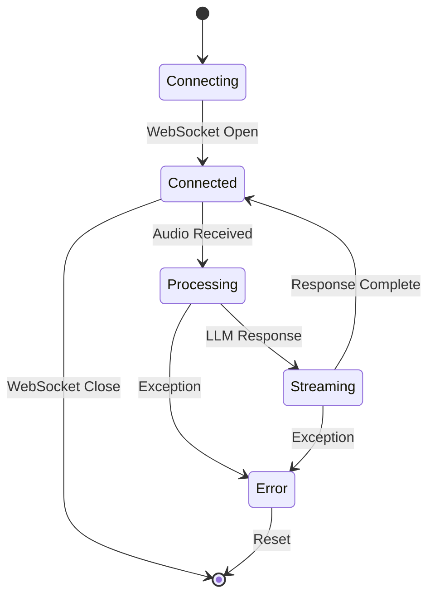
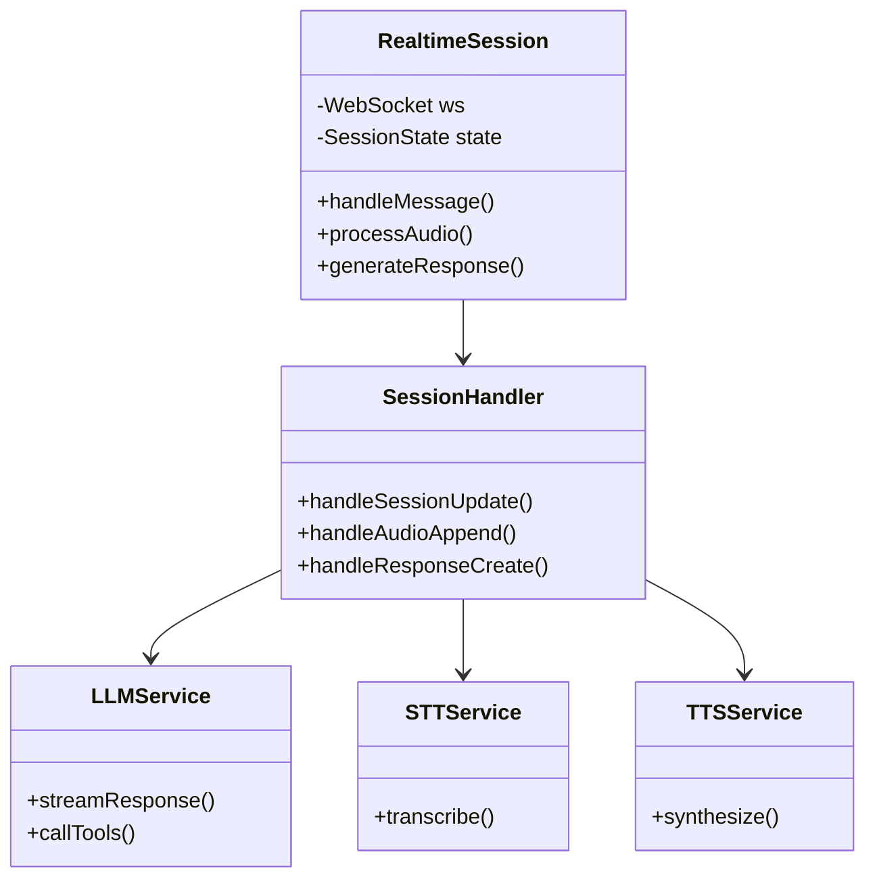

# Mermaid Diagram Examples

This page demonstrates Mermaid diagram support in the sndbrd wiki.

## Flowchart

## Sequence Diagram

## Architecture Diagram

## State Diagram

## Gantt Chart

```mermaid
gantt
    title Voice Session Timeline
    dateFormat X
    axisFormat %Ls
    
    section Audio
    Capture Audio     :0, 2000
    Process VAD       :2000, 500
    Transcribe        :2500, 1000
    
    section LLM
    Send to LLM       :3500, 500
    Stream Response   :4000, 2000
    
    section TTS
    Synthesize        :6000, 1000
    Stream Audio      :7000, 2000
```

## Class Diagram

