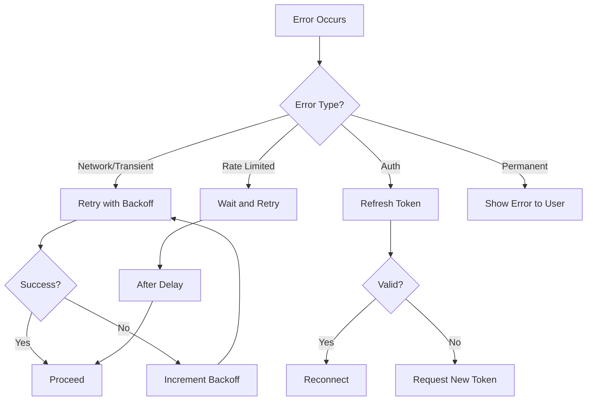

# Error Handling

Best practices for handling errors in sndbrd integrations.

## Common Errors

### Connection Errors

#### WebSocket Connection Failed

```typescript
try {
  const client = new Vowel({
    url: 'wss://your-api.com/v1/realtime',
    token: sessionToken
  });
  
  await client.connect();
} catch (error) {
  if (error.code === 'ECONNREFUSED') {
    console.error('Server is not accessible. Check your network connection.');
  } else if (error.code === 'ENOTFOUND') {
    console.error('Invalid URL. Please check your API endpoint.');
  } else {
    console.error('Connection error:', error.message);
  }
}
```

#### Token Expired

```typescript
client.on('error', (error) => {
  if (error.type === 'TOKEN_EXPIRED') {
    // Request a new token from your backend
    const newToken = await refreshToken();
    client.updateToken(newToken);
    // Reconnect
    client.connect();
  }
});
```

### Audio Errors

#### Microphone Access Denied

```typescript
async function startMicrophone() {
  try {
    mediaStream = await navigator.mediaDevices.getUserMedia({
      audio: {
        sampleRate: 24000,
        channelCount: 1
      }
    });
  } catch (error) {
    if (error.name === 'NotAllowedError') {
      alert('Microphone permission denied. Please allow microphone access.');
    } else if (error.name === 'NotFoundError') {
      alert('No microphone found. Please connect a microphone.');
    } else {
      alert('Microphone error: ' + error.message);
    }
  }
}
```

#### Audio Format Mismatch

```javascript
// Ensure audio format matches sndbrd expectations
const audioContext = new AudioContext({
  sampleRate: 24000,  // Required: 24kHz
  channelCount: 1,      // Required: Mono
  sampleFormat: 'float'  // Float32 for processing, convert to PCM16
});

// Convert Float32 to PCM16
function floatToPCM16(float32Array) {
  const pcm16 = new Int16Array(float32Array.length);
  for (let i = 0; i < float32Array.length; i++) {
    const s = Math.max(-1, Math.min(1, float32Array[i]));
    pcm16[i] = s < 0 ? s * 0x8000 : s * 0x7FFF;
  }
  return pcm16;
}
```

### LLM Errors

#### Rate Limiting

```typescript
client.on('error', (error) => {
  if (error.type === 'RATE_LIMITED') {
    console.warn('Rate limited. Please try again later.');
    // Implement exponential backoff
    setTimeout(() => retryRequest(), calculateBackoff(error.retryAfter));
  }
});
```

#### Model Unavailable

```typescript
client.on('error', (error) => {
  if (error.type === 'MODEL_UNAVAILABLE') {
    console.error('Requested model is not available.');
    console.log('Available models:', error.availableModels);
    // Fallback to default model
    client.updateSession({ model: 'moonshotai/kimi-k2-instruct-0905' });
  }
});
```

## Error Recovery Patterns

### Exponential Backoff

```typescript
async function retryWithBackoff(fn, maxRetries = 3) {
  let attempt = 0;
  
  while (attempt < maxRetries) {
    try {
      return await fn(attempt);
    } catch (error) {
      attempt++;
      
      if (attempt === maxRetries) {
        throw error;
      }
      
      // Exponential backoff: 1s, 2s, 4s...
      const delay = Math.pow(2, attempt) * 1000;
      await new Promise(resolve => setTimeout(resolve, delay));
      
      console.log(`Attempt ${attempt + 1} failed, retrying in ${delay}ms...`);
    }
  }
}

// Usage
const result = await retryWithBackoff(async () => {
  return await fetch('https://api.example.com/data');
});
```

### Graceful Degradation

```typescript
class VoiceAgent {
  private audioQuality = 'high';
  
  async handleError(error) {
    switch (error.type) {
      case 'NETWORK_SLOW':
        this.audioQuality = 'medium';
        console.warn('Network slow, reducing audio quality');
        break;
        
      case 'TTS_FAILED':
        // Fallback to text-only mode
        this.useTextOnlyMode = true;
        console.warn('TTS unavailable, using text mode');
        break;
        
      case 'VAD_UNRELIABLE':
        // Switch to manual turn-taking
        this.enableManualTurnButton();
        break;
    }
  }
}
```

### Retry Strategies



## Monitoring & Logging

### Structured Logging

```typescript
interface LogEntry {
  level: 'info' | 'warn' | 'error';
  event: string;
  timestamp: Date;
  context?: Record<string, any>;
  error?: Error;
}

function log(entry: LogEntry) {
  const logData = {
    ...entry,
    timestamp: entry.timestamp.toISOString()
  };
  
  // Send to monitoring service
  if (entry.level === 'error') {
    sendToMonitoring(logData);
  }
  
  console.log(JSON.stringify(logData));
}

// Usage
log({
  level: 'error',
  event: 'websocket_disconnected',
  timestamp: new Date(),
  context: { sessionId: 'abc123' },
  error: new Error('Connection lost')
});
```

### Health Checks

```typescript
async function checkHealth() {
  try {
    const response = await fetch('/v1/realtime/sessions', {
      method: 'HEAD',
      signal: AbortSignal.timeout(5000) // 5 second timeout
    });
    
    if (response.ok) {
      log({
        level: 'info',
        event: 'health_check_passed',
        timestamp: new Date()
      });
      return true;
    }
  } catch (error) {
    log({
      level: 'error',
      event: 'health_check_failed',
      timestamp: new Date(),
      error
    });
    return false;
  }
}

// Run health checks every 30 seconds
setInterval(checkHealth, 30000);
```

## Best Practices

1. **Always handle errors gracefully** - Never let unhandled exceptions crash the app
2. **Log errors with context** - Include relevant metadata for debugging
3. **Implement retry logic** - Use exponential backoff for transient errors
4. **Provide user feedback** - Show clear error messages and recovery options
5. **Monitor for patterns** - Track error rates to identify systemic issues
6. **Test failure scenarios** - Simulate network failures, timeouts, etc.

## Related

- [Troubleshooting](/troubleshooting) - Common issues and solutions
- [Performance](/performance) - Optimizing for speed and reliability
- [Security](/security) - Secure error handling patterns
