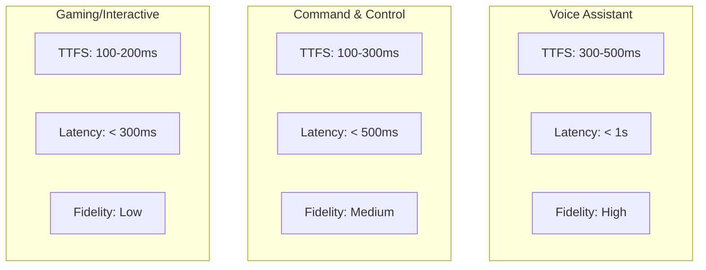

# Performance Optimization

Learn how to optimize sndbrd for low latency and high throughput.

## Performance Metrics

| Metric | Target | How to Measure |
|--------|--------|----------------|
| **TTFS** | < 500ms | Time from user speech end to first audio byte |
| **Response Latency** | < 1s | End-to-end time from speech to response |
| **First Token Time** | < 300ms | Time to first text token from LLM |
| **TTS Latency** | < 200ms | Time from text to first audio |
| **WebSocket Ping** | < 50ms | Round-trip latency to server |

## Optimizing Audio Processing

### Reduce Audio Chunk Size

Sending smaller chunks reduces latency:

```typescript
// Default: 4096 samples (~170ms)
const DEFAULT_CHUNK_SIZE = 4096;

// Optimized: 1024 samples (~42ms)
const OPTIMIZED_CHUNK_SIZE = 1024;

function sendAudioChunk(chunk: Float32Array) {
  for (let i = 0; i < chunk.length; i += OPTIMIZED_CHUNK_SIZE) {
    const subChunk = chunk.slice(i, i + OPTIMIZED_CHUNK_SIZE);
    client.sendAudio(subChunk);
  }
}
```

### Enable VAD Aggressively

Configure Voice Activity Detection for quick speech detection:

```bash
# Lower threshold = more sensitive (triggers faster)
VAD_THRESHOLD=0.3  # Default: 0.5

# Reduce silence duration = faster response
VAD_MIN_SILENCE_MS=300  # Default: 550ms
```

## Optimizing LLM Configuration

### Choose Fast Models

```typescript
const FAST_MODELS = [
  'moonshotai/kimi-k2-instruct-0905',  // ~50-100 tokens/sec
  'meta-llama/llama-3.1-8b-instruct',   // Fast inference
  'gpt-4o-mini'                           // GPT-4 optimized
];

// Avoid slow models
const SLOW_MODELS = [
  'gpt-4-turbo',           // Slower inference
  'claude-3-opus',        // Highest quality, slow
];
```

### Disable Reasoning for Real-Time

For voice applications, disable chain-of-thought reasoning:

```typescript
const sessionConfig = {
  model: 'moonshotai/kimi-k2-instruct-0905',
  reasoning_effort: 'low',  // or 'none' for some models
  // This reduces latency by ~200-500ms
};
```

### Streaming Configuration

```typescript
// Configure for low-latency streaming
const streamConfig = {
  max_tokens: 256,         // Shorter responses = faster
  temperature: 0.7,        // Lower = more deterministic
  frequency_penalty: 0.5,   // Encourage concise responses
  presence_penalty: 0.3     // Avoid repetition
};
```

## Optimizing TTS

### Choose Fast Voices

```bash
# Medium voices offer best quality/speed balance
INWORLD_VOICE=Ryan-medium  # Good balance

# For lowest latency, use lighter models
INWORLD_VOICE=Ashley-fast   # Experimental, fastest
```

### Concurrent Audio Playback

Overlap TTS generation with audio playback:

```typescript
class AudioPipeline {
  private audioQueue: AudioBuffer[] = [];
  private isPlaying = false;
  
  async playAudio(audioBuffer: AudioBuffer) {
    this.audioQueue.push(audioBuffer);
    
    if (!this.isPlaying) {
      this.isPlaying = true;
      this.processQueue();
    }
  }
  
  private async processQueue() {
    while (this.audioQueue.length > 0) {
      const buffer = this.audioQueue.shift();
      await this.playBuffer(buffer);
    }
    
    this.isPlaying = false;
  }
  
  private async playBuffer(buffer: AudioBuffer) {
    return new Promise(resolve => {
      const source = this.audioContext.createBufferSource();
      source.buffer = buffer;
      source.connect(this.audioContext.destination);
      
      source.onended = () => resolve();
      source.start();
    });
  }
}
```

## Network Optimization

### Use WebSocket over HTTP


WebSocket provides:
- **Persistent connection** - No handshake overhead
- **Bidirectional** - Server can push data
- **Low overhead** - Small frames, minimal headers

### Enable Edge Deployment

Deploy to Cloudflare Workers for:

- **Global distribution** - 300+ locations worldwide
- **Automatic routing** - Users connect to nearest edge
- **Cold starts eliminated** - Always warm at edge

```bash
# Deploy to Workers
bun run deploy:production

# Verify edge deployment
curl -H "cf-ray: see" https://api.example.com/v1/health
```

### Compression

Enable WebSocket compression:

```typescript
const client = new Vowel({
  url: 'wss://api.example.com/v1/realtime',
  compression: 'gzip'  // Enable if supported
});
```

## Caching Strategies

### Cache LLM Responses

```typescript
class ResponseCache {
  private cache = new Map<string, string>();
  
  getCachedResponse(prompt: string): string | null {
    // Normalize prompt for cache key
    const key = this.normalizePrompt(prompt);
    return this.cache.get(key) || null;
  }
  
  cacheResponse(prompt: string, response: string): void {
    const key = this.normalizePrompt(prompt);
    this.cache.set(key, response, {
      ttl: 60000  // 1 minute TTL
    });
  }
  
  private normalizePrompt(prompt: string): string {
    return prompt.toLowerCase().trim();
  }
}
```

### Preload Resources

```typescript
// Preload TTS voices
await preloadVoices(['Ashley', 'Ryan']);

// Preload VAD models
await loadVADModel();

// Warm connections
const warmupConnection = new Vowel({ /* config */ });
await warmupConnection.connect();
warmupConnection.disconnect();
```

## Monitoring Performance

### Measure Latency at Each Stage

```typescript
interface PerformanceMetrics {
  vadTrigger: number;
  transcriptionComplete: number;
  llmFirstToken: number;
  ttsComplete: number;
  audioPlaybackStart: number;
}

const metrics: PerformanceMetrics = {
  vadTrigger: Date.now()
};

client.on('speech_detected', () => {
  metrics.vadTrigger = Date.now();
});

client.on('transcript', () => {
  metrics.transcriptionComplete = Date.now();
  const vadToTranscript = metrics.transcriptionComplete - metrics.vadTrigger;
  console.log(`VAD → Transcript: ${vadToTranscript}ms`);
});

client.on('text_delta', () => {
  if (!metrics.llmFirstToken) {
    metrics.llmFirstToken = Date.now();
    const transcribeToFirstToken = metrics.llmFirstToken - metrics.transcriptionComplete;
    console.log(`Transcript → First Token: ${transcribeToFirstToken}ms`);
  }
});
```

### Use Performance API

```typescript
const observer = new PerformanceObserver((list) => {
  list.getEntries().forEach(entry => {
    console.log(`${entry.name}: ${entry.duration}ms`);
  });
});

observer.observe({
  type: 'measure',
  buffered: true
});

// Mark key events
performance.mark('connection-start');
// ... connection process ...
performance.mark('connection-connected');
performance.measure('connection-time', 'connection-start', 'connection-connected');
```

## Performance Targets by Use Case



## Common Bottlenecks

### 1. STT Latency

**Symptoms:** Long delay after speech ends

**Solutions:**
- Switch to streaming STT (AssemblyAI, Fennec)
- Reduce audio buffer size
- Lower VAD threshold

### 2. LLM Inference Time

**Symptoms:** Slow text generation

**Solutions:**
- Use faster models (Kimi, Llama 8B)
- Reduce max_tokens
- Disable reasoning effort
- Use Groq for 500+ tokens/sec

### 3. TTS Generation

**Symptoms:** Gap between text and audio

**Solutions:**
- Use TTS streaming (not batch)
- Choose faster voices
- Enable concurrent playback

### 4. Network Latency

**Symptoms:** Delayed packets

**Solutions:**
- Deploy to edge (Workers)
- Enable compression
- Reduce audio packet size

## Related

- [Architecture Overview](/architecture/overview) - System design
- [Connection Paradigms](/architecture/connection-paradigms) - Integration patterns
- [Monitoring](/guides/monitoring) - Setup observability
