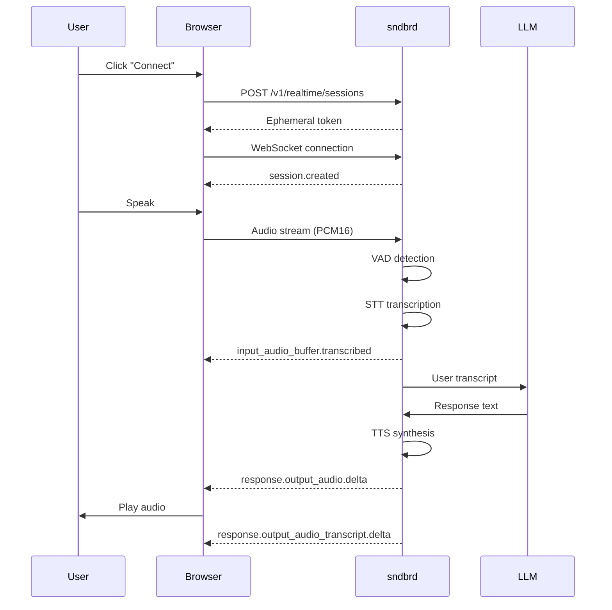

# Tutorial: Building a Voice Agent

Learn how to build a simple voice agent using sndbrd and the OpenAI Agents SDK.

## Overview

In this tutorial, you'll build a voice agent that:
- Connects to sndbrd via WebSocket
- Streams audio from the user's microphone
- Receives AI responses as text and audio
- Supports custom tools/functions

## Prerequisites

- Complete the [Quick Start](/getting-started) guide
- Basic knowledge of JavaScript/TypeScript
- A modern web browser (Chrome, Firefox, Safari, Edge)

## Step 1: Set Up the Project

```bash
# Create a new directory
mkdir my-voice-agent
cd my-voice-agent

# Initialize package.json
npm init -y

# Install dependencies
npm install @openai/agents
```

## Step 2: Create the HTML

```html
<!DOCTYPE html>
<html lang="en">
<head>
  <meta charset="UTF-8">
  <title>My Voice Agent</title>
  <style>
    body {
      font-family: system-ui, sans-serif;
      max-width: 800px;
      margin: 0 auto;
      padding: 2rem;
    }
    .controls {
      display: flex;
      gap: 1rem;
      margin-bottom: 2rem;
    }
    button {
      padding: 0.75rem 1.5rem;
      border: none;
      border-radius: 8px;
      cursor: pointer;
      font-size: 1rem;
    }
    .connect { background: #6366f1; color: white; }
    .disconnect { background: #ef4444; color: white; }
    .transcript {
      background: #f3f4f6;
      padding: 1rem;
      border-radius: 8px;
      margin-bottom: 1rem;
    }
  </style>
</head>
<body>
  <h1>My Voice Agent</h1>
  
  <div class="controls">
    <button id="connect" class="connect">Connect</button>
    <button id="disconnect" class="disconnect" style="display:none;">Disconnect</button>
  </div>
  
  <div id="transcript" class="transcript">
    <p>Transcripts will appear here...</p>
  </div>
  
  <script type="module" src="app.js"></script>
</body>
</html>
```

## Step 3: Implement the Client

```javascript
import { Vowel } from '@openai/agents';

// Configuration
const CONFIG = {
  wsUrl: 'ws://localhost:8787/v1/realtime',
  apiKey: process.env.API_KEY,
  model: 'moonshotai/kimi-k2-instruct-0905',
  voice: 'Ashley'
};

// Initialize the client
let client = null;
let audioContext = null;
let mediaStream = null;

// DOM elements
const connectBtn = document.getElementById('connect');
const disconnectBtn = document.getElementById('disconnect');
const transcriptDiv = document.getElementById('transcript');

// Connect to sndbrd
connectBtn.addEventListener('click', async () => {
  try {
    // Request ephemeral token
    const response = await fetch('http://localhost:8787/v1/realtime/sessions', {
      method: 'POST',
      headers: {
        'Authorization': `Bearer ${CONFIG.apiKey}`,
        'Content-Type': 'application/json'
      },
      body: JSON.stringify({
        model: CONFIG.model,
        voice: CONFIG.voice
      })
    });
    
    const { client_secret } = await response.json();
    const token = client_secret.value;
    
    // Initialize Vowel client
    client = new Vowel({
      url: CONFIG.wsUrl,
      token: token,
      onError: (error) => console.error('WebSocket error:', error)
    });
    
    // Register event handlers
    client.on('user.transcript', (transcript) => {
      updateTranscript(`You: ${transcript}`);
    });
    
    client.on('agent.audio', (audio) => {
      // Play AI audio response
      playAudio(audio);
    });
    
    client.on('agent.transcript', (transcript) => {
      updateTranscript(`Agent: ${transcript}`);
    });
    
    client.on('connected', () => {
      updateTranscript('Connected to voice agent!');
      connectBtn.style.display = 'none';
      disconnectBtn.style.display = 'block';
    });
    
    // Connect to the server
    await client.connect();
    
    // Start capturing microphone
    await startMicrophone();
    
  } catch (error) {
    updateTranscript(`Error: ${error.message}`);
  }
});

// Disconnect
disconnectBtn.addEventListener('click', () => {
  if (client) {
    client.disconnect();
    stopMicrophone();
    connectBtn.style.display = 'block';
    disconnectBtn.style.display = 'none';
    updateTranscript('Disconnected.');
  }
});

// Start microphone capture
async function startMicrophone() {
  try {
    mediaStream = await navigator.mediaDevices.getUserMedia({
      audio: {
        sampleRate: 24000,
        channelCount: 1,
        echoCancellation: true,
        noiseSuppression: true
      }
    });
    
    audioContext = new AudioContext({ sampleRate: 24000 });
    const source = audioContext.createMediaStreamSource(mediaStream);
    const processor = audioContext.createScriptProcessor(4096, 1, 1);
    
    processor.onaudioprocess = (e) => {
      // Send audio to client
      if (client && client.isConnected) {
        client.sendAudio(e.inputBuffer.getChannelData(0));
      }
    };
    
    source.connect(processor);
    processor.connect(audioContext.destination);
    
  } catch (error) {
    console.error('Microphone error:', error);
    updateTranscript(`Microphone error: ${error.message}`);
  }
}

// Stop microphone capture
function stopMicrophone() {
  if (mediaStream) {
    mediaStream.getTracks().forEach(track => track.stop());
  }
  if (audioContext) {
    audioContext.close();
  }
}

// Play audio response
function playAudio(pcmData) {
  if (!audioContext) {
    audioContext = new AudioContext({ sampleRate: 24000 });
  }
  
  const audioBuffer = audioContext.createBuffer(1, pcmData.length, 24000);
  audioBuffer.copyToChannel(new Float32Array(pcmData), 0);
  
  const source = audioContext.createBufferSource();
  source.buffer = audioBuffer;
  source.connect(audioContext.destination);
  source.start();
}

// Update transcript display
function updateTranscript(text) {
  transcriptDiv.innerHTML = `<p>${text}</p>`;
}
```

## Step 4: Add a Custom Tool

Define a tool that the AI can call:

```javascript
// Register a custom tool
client.registerAction('searchDatabase', {
  description: 'Search the product database for items',
  parameters: {
    type: 'object',
    properties: {
      query: {
        type: 'string',
        description: 'Search query'
      },
      category: {
        type: 'string',
        description: 'Product category to filter by'
      }
    },
    required: ['query']
  }
}, async ({ query, category }) => {
  // Implement your tool logic here
  console.log(`Searching for: ${query} in ${category || 'all'}`);
  
  const results = await fetch(`/api/search?q=${query}&cat=${category || ''}`)
    .then(r => r.json());
  
  return results;
});

client.on('toolCall', (toolCall) => {
  updateTranscript(`Agent called: ${toolCall.name}`);
});
});
```

## Step 5: Run the Application

```bash
# Create a simple server to serve the app
npm install -g serve

# Start the server
serve .
```

Navigate to `http://localhost:3000` and click "Connect" to start.

## How It Works



## Next Steps

- Add more [custom tools](/guides/tools) for your use case
- Implement [error handling](/guides/error-handling) for better UX
- Deploy with [Cloudflare Workers](/deployment/cloudflare)
- Add [multi-language support](/guides/internationalization)

## Complete Example

See the `demo/` directory in the sndbrd repository for a complete working example with React.
